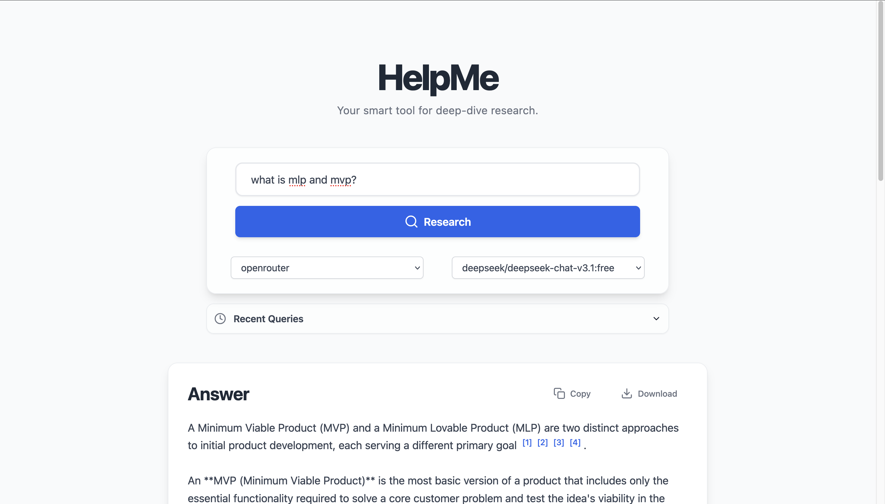

<div align="center">
  <h1 align="center">🚀 HelpMe - AI Research Assistant</h1>
  <p align="center">
    A smart, multi-agent research tool that dives deep into any topic to provide synthesized, source-backed answers.
  </p>
</div>

---

 
*Note: Add a screenshot of the application to the `_docs` folder.*

## ✨ About The Project

HelpMe is an AI-powered research assistant designed to streamline the process of gathering, analyzing, and synthesizing information from the web. It uses a sophisticated multi-agent system to deliver comprehensive answers complete with source citations, making it an ideal tool for students, researchers, and anyone looking to get up to speed on a new topic quickly.

The application features a clean, modern, and responsive web interface built with React and Tailwind CSS, and a powerful backend powered by FastAPI.

### Key Features

-   **🧠 Multi-Agent System:** A **Researcher Agent** scours the web for relevant information, and a **Synthesizer Agent** processes the findings to generate a coherent, human-readable answer.
-   **🌐 LLM Agnostic:** Easily switch between different Large Language Models. The app supports both Google's **Gemini** and any model available through **OpenRouter**, including free models.
-   **📜 Sourced Answers:** Every answer is backed by a clear list of sources, allowing you to verify the information and explore topics further.
-   **🎨 Modern UI:** A polished, responsive, and intuitive user interface built with React and Tailwind CSS, designed for a great user experience.
-   **💾 Persistent History:** Your recent search queries are saved in your browser, so you can easily revisit them.
-   **⚙️ Dynamic Configuration:** Select your preferred LLM provider and model on the fly, directly from the UI.
-   **💻 Debugging Panel:** A collapsible JSON viewer to inspect the raw research data returned by the agents.

---

## 🛠️ Tech Stack

This project is built with a modern, robust tech stack:

| Component         | Technology                                                                                             |
| ----------------- | ------------------------------------------------------------------------------------------------------ |
| **Backend**       |   |
| **Frontend**      |    |
| **LLM Providers** | Google Gemini, OpenRouter                                                                              |
| **Database**      |  for storing results. |

---

## 🚀 Getting Started

Follow these instructions to get a local copy up and running.

### Prerequisites

-   **Python 3.10+** and `pip`
-   **Node.js 18+** and `npm`
-   Git

### Installation & Setup

1.  **Clone the repository:**
    ```sh
    git clone https://github.com/your-username/HelpMe.git
    cd HelpMe
    ```

2.  **Backend Setup:**
    ```sh
    # Create and activate a virtual environment
    python -m venv .venv
    source .venv/bin/activate  # On Windows, use: .venv\Scripts\activate

    # Install Python dependencies
    pip install -r requirements.txt
    ```

3.  **Frontend Setup:**
    ```sh
    # Navigate to the frontend directory and install npm packages
    cd frontend
    npm install
    cd .. 
    ```

4.  **Configure API Keys:**
    -   Create a `.env` file in the project root by copying the example:
        ```sh
        cp .env.example .env
        ```
    -   Open the `.env` file and add your API keys for Gemini and/or OpenRouter.

5.  **Review Configuration:**
    -   Open `config.yaml` to see the default LLM providers, models, and other settings. You can adjust these defaults as needed.

### Running the Application

You'll need to run the backend and frontend servers in two separate terminals.

1.  **Run the Backend Server:**
    ```sh
    # Make sure your virtual environment is activated
    uvicorn backend.main:app --reload
    ```
    The backend will be running at `http://127.0.0.1:8000`.

2.  **Run the Frontend Development Server:**
    ```sh
    cd frontend
    npm run dev
    ```
    The frontend will be available at `http://localhost:5173`.

---

## License

Distributed under the MIT License. See `LICENSE` for more information.

## Author

**Aditya S Rathore**