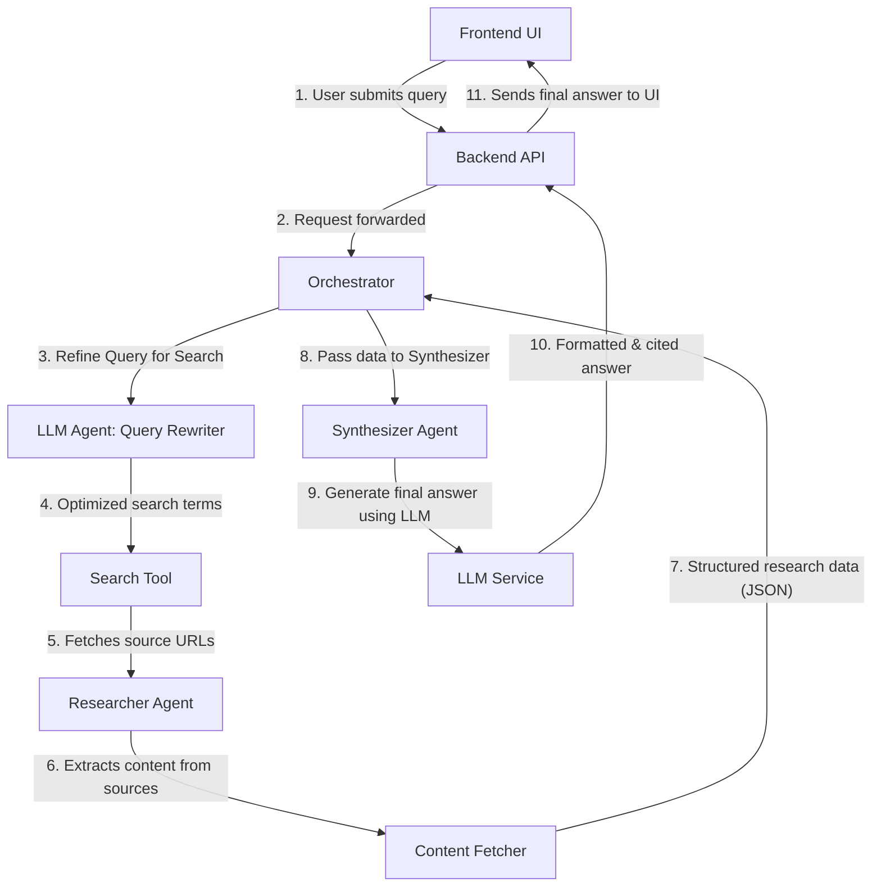

# Project Approach: Autonomous Research Assistant

This document outlines the technical architecture and strategy for building **HelpMe**, an autonomous agent system designed to answer complex user queries by researching, synthesizing, and citing information from online sources.

**Objective:** To build a system that can take a query, such as *"What is the RICE scoring model for prioritization, and how is it different from the Kano model?"*, and produce a single, reliable, and well-cited answer.

---

## 1. High-Level Architecture

The system is built on a decoupled client-server model to ensure a clean separation of concerns, scalability, and maintainability.

-   **Frontend:** A **React** Single-Page Application (SPA) provides a clean, responsive user interface for a student or user to submit their question.
-   **Backend:** A high-performance **Python API server using FastAPI** orchestrates the multi-agent research and synthesis workflow.
-   **External Services:** The backend integrates with third-party APIs for Large Language Models (LLMs) and web search.

### Core Workflow: From Question to Answer

The system follows a structured, multi-step process to handle a user's query, mimicking the workflow of a human research assistant.

---

## 2. The Autonomous Agent System

The core of the backend is a multi-agent system where each agent has a specialized role. This modular design makes the logic easy to follow, debug, and extend.

1.  **Orchestrator:** The central controller that manages the entire workflow, passing the query and data between the other agents and tools.

2.  **Researcher Agent:** This agent's primary responsibility is to find and process reliable information.
    -   **Query Refinement:** It first uses an LLM with a specialized prompt (`query_rewriter_system.txt`) to transform the user's natural language question into a set of concise, keyword-driven search queries. This is a critical step for improving the relevance of search results.
    -   **Source Aggregation:** It uses a search tool (defaulting to DuckDuckGo) to find relevant articles and URLs.
    -   **Content Extraction:** For each URL, it uses the `newspaper3k` library to intelligently extract the core article content, filtering out ads and boilerplate. To avoid being blocked, the fetcher identifies itself with a standard browser `User-Agent` header. All sources are fetched concurrently to minimize latency.

3.  **Synthesizer Agent:** This agent's role is to transform the structured JSON data from the Researcher into a high-quality, human-readable answer.
    -   **Prompt Engineering:** The agent uses a carefully crafted system prompt (`synthesizer_system.txt`) that instructs the LLM to act as a professional research analyst.
    -   **Core Directives:** The prompt enforces strict rules:
        1.  Base the answer **only** on the provided source data to prevent hallucinations.
        2.  Meticulously cite sources using a clear format (e.g., `[1]`, `[2]`).
        3.  Follow strict formatting rules (Markdown) to ensure the frontend can correctly render the answer and link citations.

---

## 3. Key Technical Decisions

The technology stack was chosen to prioritize performance, user experience, and maintainability.

-   **Backend (FastAPI & Python):** FastAPI was chosen for its high performance, asynchronous capabilities, and automatic API documentation. Python's extensive ecosystem of data processing and AI libraries makes it the ideal choice for the backend logic.

-   **Frontend (React & Vite):** React allows for the creation of a dynamic and component-based UI. Vite provides a fast and efficient development experience. The application logic is separated into custom React Hooks (`useQueryHistory`, `useResearch`) to keep the UI components clean and maintainable.

-   **LLM Agnostic Design:** The system is designed to be flexible in its use of LLMs.
    -   **Default (OpenRouter):** It defaults to OpenRouter, an aggregator that provides access to a wide variety of models, including free, open-source options. This ensures the application can be run without requiring paid API keys.
    -   **Alternative (Google Gemini):** Native support for Google's Gemini models is also included for users who require higher-quality synthesis.
    -   The user can switch between any configured provider and model directly from the UI.

---

## 4. Setup and Run Instructions

*Note: These instructions are also available in the main `README.md` file.*
 

### Prerequisites

-   Python 3.10+ and `pip`
-   Node.js 18+ and `npm`

### Installation & Setup

1.  **Clone the repository and navigate into it.**
2.  **Backend:** Create a virtual environment, activate it, and run `pip install -r requirements.txt`.
3.  **Frontend:** Navigate to the `frontend` directory and run `npm install`.
4.  **API Keys:** Create a `.env` file from `.env.example` and add your API keys for Gemini and/or OpenRouter.

### Running the Application

1.  **Run Backend Server:** `uvicorn backend.main:app --reload`
2.  **Run Frontend Server:** `cd frontend && npm run dev`

The application will be available at `http://localhost:5173`.